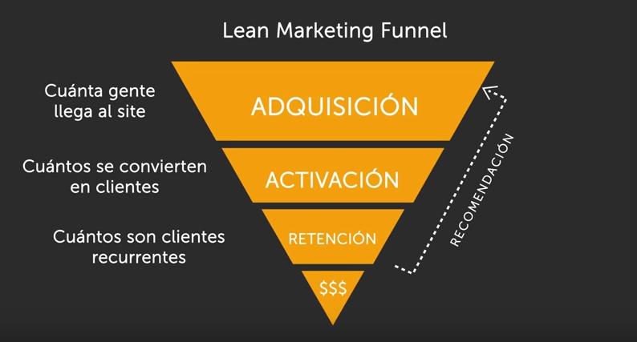
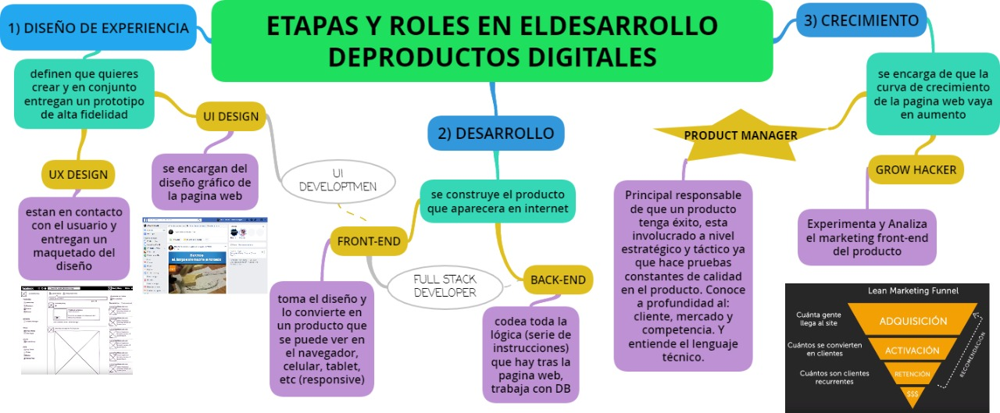
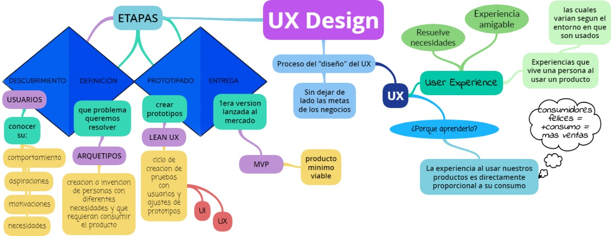
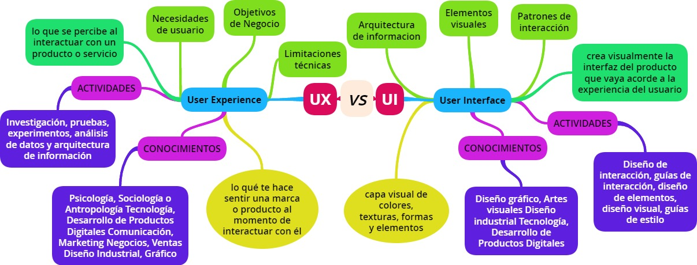

# Ux Design

**¿Por qué aprender esto?**

Permite crear mejores productos digitales.

Conocer el rol que cada uno tiene dentro del desarrollo del producto para trabajar mejor en equipo.

# Etapas (3):

1. DISEÑO DE EXPERIENCIA
2. DESARROLLO
3. CRECIMIENTO

ROLES:

**UX**: Constante comuciación con los usuarios  porque necesitan entender cuales son sus problemas y sus necesidades, define la arquitectura de informacion de tu producto como el usuario navega por la plataforma y investigan de la competencia. Es una persona muy sociable y analítico.

Su resultado final es entregar una estrategia de diseño WIREFRAME y prototipos.

**UI**: transforman los resultados de Ux incluye todo el aspecto visual filtros, buscadores, tipo de letras, diseño, interaccion del usuario. Es una persona muy visual muy grafica.

Todo esto termina con un PROTOTIPO DE ALTA FIDELIDAD y esto es lo q se entrega al equipo de desarrollo.

Es el proceso mediante el cual se diseñan las experiencias que vivirá un usuario al usar un producto.

1. DESARROLLO

  **Front end**: creación de la pagina web.

  **Back end**: Se encarga de toda la lógica.

2. CRECER

  

**Grow Hacker** -- Encuentra las fortalezas y debilidades de tu modelo hace lo q sea necesario para mejorarlo.

**Product manager**: Es el encargado de todo.

***
**¿Qué es User Experience Design?**

Es el como experimentas el mundo, experimentas tu vida, el como experimentas el servicio o producto.

Son todas las experiencias que vive/experimenta una persona al usar un producto.

## Ux

Donal Norman 1995 uso por 1era vez el termino

Proceso de diseño para resolver las necesidades de nuestros usuarios, brindandoles la experiencia menos confusa y mas amigable posible. (*Resolver necesidades y experiencia amigable*)

Proceso de diselño Ux:

**Descubrimiento** (quien es el usuario y cuales son su necesidades)/

USUARIOS: comportamiento, aspiraciones, motivacion y necesidades.

HERRAMIENTAS: Entrevistas, dinamicas de observacion, encuestas en linea.

**Definicion** (De todo lo q descubrimos acotamos y empezamos analizar cual es el problema que resolveremos)/

HERRAMIENTA: Arquetipos(es un usuario que incorpora sus metas, sus necesidades y su intereses) esta herramienta personifica al usuario y lo pone en centro del diseño.

**Prototipado** (Diseñamos y prototipamos las posibles soluciones, q luego probamos en usuarios finales)/

metodologia Lean Ux es para validar q soluciones funciones y cuales no. Consiste en prueba con usuarios y prototipos. (contruye, mide y aprende).
Para ellos los Ux crean Side Maps y Diagramas de flujo pero los Ui colores tipografia q boton tien tal funcion y los efectos visuales q debemos incluir.
Primero se comienza sketches manual se le muestra a usuarios y se recopila la info para luego crear un WIREFRAME incluso agregar *invision* q son herramientas q son clickeables.

Mockups diseño parecido al producto final.

Prototipo: simulacion de un producto digital es para testear antes de invertir en el desarrollo.

**Entrega** (Definimos cual de las soluciones es la mejor y la pasamos al equipo de desarrollo)

MVP--- Es el producto q se trabaja en codigo.

***
# Navegacion

**Global**: Es la navegación principal del site. Normalmente es persistente y nos ayuda a explorar todas las opciones del site.

**Local:** Es la navegación “localizada” a una página o vista. En algunos casos, algunas páginas internas tienen su propia navegación que ayuda al usuario a explorar esa vista en particular.

**Facetada:** Es la navegación a través de filtros no editables, definidos previamente por el sistema.

**Filtrada:** En este tipo de navegación le damos al usuario todos los resultados de la búsqueda y le damos una serie de opciones de filtros para que él mismo pueda filtrar.

**Contextual:** Es la navegación acorde al contexto en el que está navegando el usuario. Se usa principalmente para recomendaciones.

**En línea (inline):** Son links de referencia utilizados principalmente en artículos.

**Suplementaria:** Es la navegación adicional, a veces temporal, utilizada para señalar algunas funciones a nuevos usuarios.

